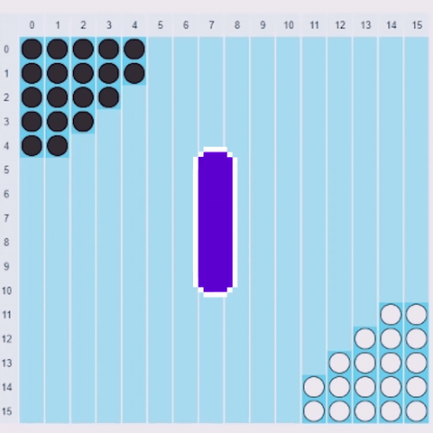

<p align="center">
    
    <h2 align="center">Halma AI</h2>
</p> 
<p align="center">A halma checker game with AI Agent that can make yourself better...</p>

## ✨ Features

- GUI / CMD Board
- Multiple size board (8x8, 10x10, 16x16)
- Multiple AI Agent Style (Minmax, Local Search)
- Multiple Game Mode (Player vs AI, AI vs AI)

### Usage
1. (optional)Install virtualenv if you haven't
```bash
pip install virtualenv
```
2. Create a virtualenv
```bash
$ virtualenv venv
```
3. Activate the env 
4. Download required dependencies 

### Activate env for python:
1. For windows
```bash
$ venv\Scripts\activate
```
2. For macOS / Linux
```bash
$ source venv/bin/activate
```
### Download required dependencies:
```bash
pip install -r requirements.txt
```

### Adding dependencies
```bash
$ pip freeze > requirements.txt
```

### Available scripts :
Simply just run this command to play this game, even you don't have the dependencies installed : 
Windows : 
```bash
run.bat
```
Linux/MacOS: 
```bash
run.sh
```

## 📚 Tech Stack
- Python
- PySimpleGUI

## Contributor
* [William](https://github.com/William9923)
* [Stefanus](https://github.com/stanleyyoga123)
* [Tony](https://github.com/tonyeko)
* [Jovan](https://github.com/JovanKaruna)

## ❤️ Support
If you feel that this repo have helped you provide more example on learning software engineering, then it is enough for me! Wanna contribute more? Please ⭐ this repo so other can see it too!
